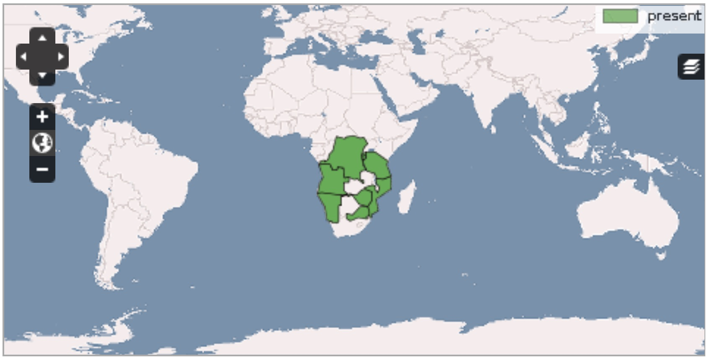
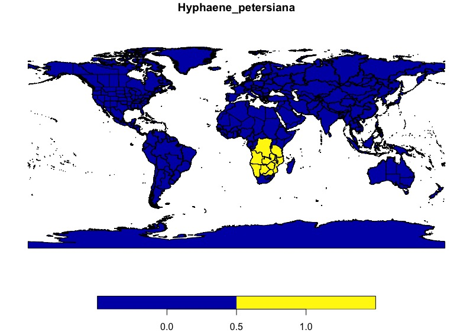

# Shiny-Palm-Atlas
Seeking to replicate palmweb with botanical countries, and then expand upon it with cleaned species occurence points, including options to refine searches.

```R
# Wolf's shapefile path
shapefile_path <- "data/tdwg_level3_shp"

BotCon <- st_read(paste(shapefile_path, "/level3.shp", sep=""))

# plots the first variable in data frame (LEVEL3_NAM) with some default colour coding
plot(BotCon[1])

# generates a fake species (just some random 1s and 0s)
BotCon$mock_species <- sample(c(0,1), 369, replace=TRUE)

# check that variable has been generated corerclty
str(BotCon)

# plots the mock species with some default colour coding
plot(BotCon["mock_species"])

# Wolf's path to occurrence data
occurrence_path <- "data"

# read occurrence data
occ <- read.csv(paste(occurrence_path, "/palms_in_tdwg3.csv", sep=""))

# choose a species
sp <- "Hyphaene_petersiana"

# get name of countries in which the species occurs, by selecting all rows in occ that are == species name, and only first column. 
sp_occ <- as.vector(occ[occ$SpecName == sp,"Area_code_L3"])

# create a new column for the species, all zeros for now
BotCon[,sp] <- rep(0, nrow(BotCon))

# set the rows where BotCon$LEVEL3_COD in sp_occ to 1
BotCon[BotCon$LEVEL3_COD %in% sp_occ,sp] <- 1

# check that species has been generated correctly
str(BotCon)

# plot it
plot(BotCon[sp])
```



